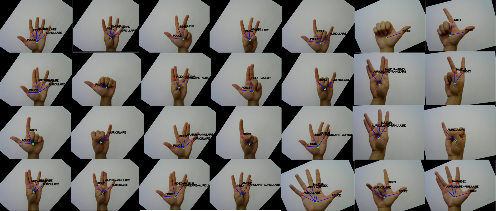

# 🖐️ Segmentation de la main et reconnaissance de gestes

> Projet de dernière année d'école d'ingénieur (réalisé en 1 mois) | CPE Lyon – Projet Majeure 2024–2025  
> Auteurs : Guillaume Brussieux, Juan Reyes-Ortiz  
> Encadrante : Marion Foare

## 📌 Présentation du projet

Ce projet vise à implémenter un système robuste de **segmentation de la main et de reconnaissance de gestes**, basé sur des techniques classiques de traitement d’images. L’application peut répondre à plusieurs cas d’usage :

- Interfaces contrôlées par gestes  
- Traduction du langage des signes  
- Alternative légère aux détecteurs basés sur l’IA

Le pipeline repose sur une **segmentation géométrique précise** de la main et l’identification des **zones anatomiques clés** (doigts, paume, poignet), suivie d’une **classification des gestes** à partir de ces structures.

---

## 🛠️ Technologies utilisées

- **Python 3**
- **OpenCV** – traitement d’images et capture caméra en temps réel  
- **NumPy** – opérations matricielles  
- **Tkinter** – interface graphique utilisateur (GUI)

---

## 📷 Pipeline de traitement

1. **Seuillage HSV** : détection de la main par segmentation colorimétrique sur fond uniforme  
2. **Carte de distances + cercle de la paume** : localisation du centre de la paume  
3. **Détection de la ligne du poignet** : séparation du poignet et de la paume  
4. **Détection des doigts** : analyse des contours et boîtes englobantes  
5. **Correction de rotation** : normalisation de l’orientation de la main  
6. **Reconnaissance de gestes** : basée sur le nombre de doigts, l’angle du pouce, la symétrie…

---

## 💡 Fonctionnalités principales

- Traitement vidéo en temps réel  
- Curseurs HSV ajustables par l'utilisateur pour le calibrage  
- Détection des différentes parties de la main : poignet, paume, doigts  
- Classification des gestes selon des règles géométriques  
- Algorithme léger, sans deep learning

---

## ⚠️ Limitations

- Nécessite un **fond uniforme** pour la segmentation HSV  
- Ne gère pas les **déformations de la main** ni les **rotations multi-axes**  
- La performance diminue quand plusieurs doigts sont **collés**  
- Peu robuste aux **fortes variations de lumière** ou de morphologie (enfant, ouvrier…)

---

## 🚀 Pistes d’amélioration

- Intégrer un **calibrage personnalisé** pour chaque utilisateur  
- Remplacer le HSV par une **détection de peau basée sur apprentissage automatique**  
- Ajouter un **lissage temporel** pour améliorer la stabilité des gestes  
- Renforcer la robustesse vis-à-vis de l’arrière-plan et des conditions lumineuses

---

## 📂 Structure du dépôt

```
automatic_measurement
│   README.md
│   main.py
│   
│
├───utils
│   │   circle.py
│   │   bounding_boxes.py
│   │   maths_tools.py
│   │   miscellanous.py
│   │   processing_tools.py
│   │   palm.py
│   │   jeu.py
│   │   circle.py
│   │   bounding_boxes.py
│   │   launch_hsv_adjuster.py
│   │   dictionnary.py

```

---

---

## 📸 Captures d’écran

Exemple de résultat de segmentation et détection de gestes :



---

## 📚 Bibliographie

- Zhi-hua Chen, *Real-Time Hand Gesture Recognition Using Finger Segmentation*, 2021  
- Léonard de Vinci, *Étude de la main humaine*  
- Documentation OpenCV

---

## 🧠 Auteurs

- **Guillaume Brussieux**  
- **Juan Reyes-Ortiz**
